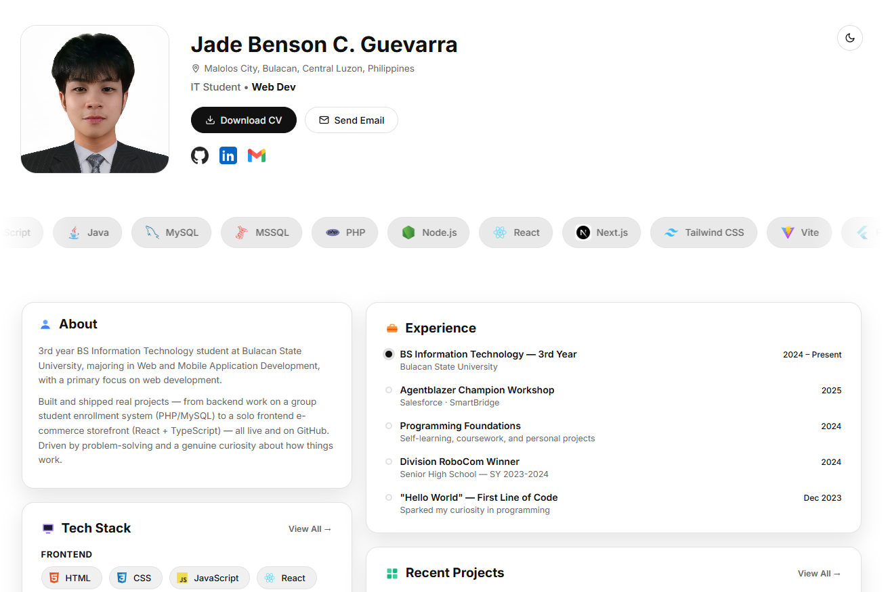

# My Portfolio

Personal portfolio site built with React + Vite. Showcases projects, certifications, tech stack, and background.



> 🔗 **Live site:** [portfolio-site-opal-six.vercel.app](https://portfolio-site-opal-six.vercel.app)

## Tech Stack

- React 19 + Vite
- Vanilla CSS (custom components, no UI framework)
- Formspree for the contact form

## Getting Started

```bash
npm install
cp .env.example .env   # then fill in your own values
npm run dev
```

## Structure

- `src/data/portfolio.js` — single source of truth for content (projects, certs, experience, tech stack). Update this file to change site content without touching components.
- `src/components/` — Hero, Dashboard, Footer
- `public/` — images and static assets

## Build

```bash
npm run build
npm run preview
```
